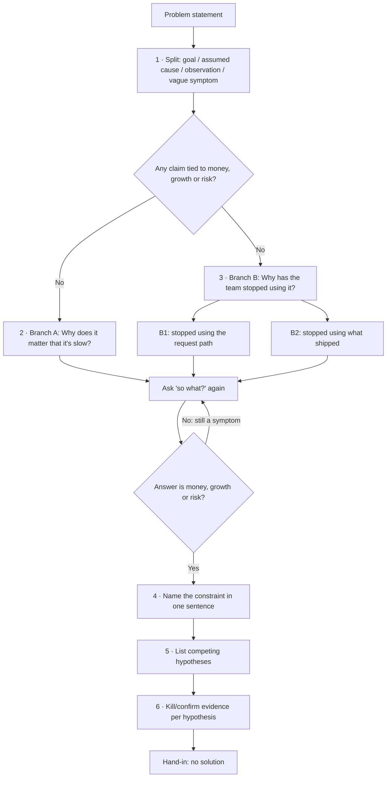

# 04 — The diagnosis workflow (as a system)

**Inputs:** a problem statement, sometimes a stakeholder. **Output:** one named constraint, with chains ending at money, growth, or risk, plus kill/confirm evidence. **Not output:** a solution.

## Pipeline

## Steps
| Step | Move | Question to ask | Output |
|---|---|---|---|
| 1 | **Split** | "Which of these have you actually seen?" | Claims table |
| 2 | **Define slow** | "Slow compared to what clock?" | Lead time vs need half-life |
| 3 | **Branch A** | "Why does it matter that it's slow?" (repeat) | Chain ending at money or growth |
| 4 | **Branch B** | "Why has the team stopped using it? The form, or the thing?" | Chains B1 and B2 ending at risk or money |
| 5 | **Name** | "What single rule or condition produces all of these?" | One-sentence constraint |
| 6 | **Compete** | "What else could explain this?" | 3–5 hypotheses |
| 7 | **Test** | "What would prove me wrong?" | Kill/confirm metrics |

## 5-minute version (the hand-in)
| Time | Do |
|---|---|
| 0:00–0:45 | Split the sentence into claims |
| 0:45–2:00 | Branch A, 3 whys to money or growth |
| 2:00–3:15 | Branch B, B1 and B2 to risk or money |
| 3:15–3:45 | Write the one-sentence constraint |
| 3:45–4:30 | 3 confirm/kill metrics |
| 4:30–5:00 | Remove any solution language and hand in |

## 10-minute version (live, with a stakeholder)
| Time | Do |
|---|---|
| 0:00–1:30 | Read the sentence back as four claims; the stakeholder marks each seen or believed |
| 1:30–3:30 | Why slow matters; get one concrete expired request |
| 3:30–4:30 | Hinge: is shipped work being used? (decides capacity vs conversion) |
| 4:30–6:30 | B1: why people abandon the request path; find shadow demand |
| 6:30–8:00 | B2: why shipped flows die (owner, fit, trust) |
| 8:00–9:00 | Name money, growth, and risk explicitly |
| 9:00–10:00 | Constraint sentence plus evidence list. Stop. |

## Stop conditions
- **Stop a chain** when the answer is a cost, revenue or cash effect, a scaling limit, or a named risk (security, compliance, key-person, reputation).
- **Don't stop** at: "it's slow", "people are frustrated", "engineers are busy", or "we need more X". Those are symptoms or solutions.
- **Stop the whole exercise** when one sentence explains every branch, and you can name a measurement that would prove it wrong.

## Anti-patterns
| Anti-pattern | Looks like | Fix |
|---|---|---|
| Jumping to solutions | "Deploy a self-service platform" | Ask "what constraint would that relieve, and have we confirmed it?" |
| Inventing data | "-14% conversion" with no source | Mark it *(hyp.)* and say how to measure the real figure |
| Stopping at a symptom | "Engineers are bottlenecked" | Ask "so what?" again |
| Single-chain 5 Whys | One linear story | Branch at least twice; 5 Whys is known to miss multiple causes ([limits](https://en.wikipedia.org/wiki/Five_whys)) |
| Accepting the stated cause | "People don't know how" → training | Test H5 against H1–H4 |
| Counting the queue as demand | "Backlog = 40, so we need 4 more engineers" | Count *used* output and *off-ticket* demand |
| Elevating first | Hire before exploiting or subordinating | Follow ToC order: identify → exploit → subordinate → elevate |
